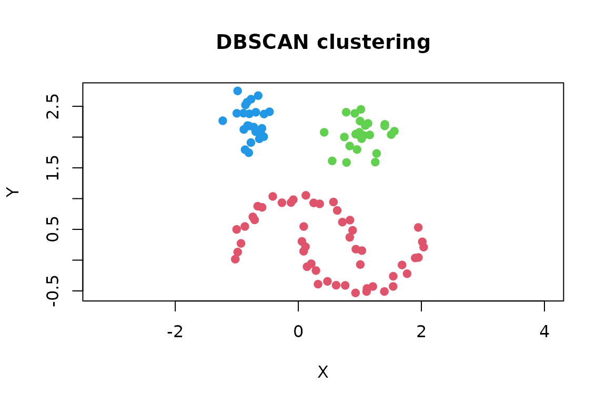
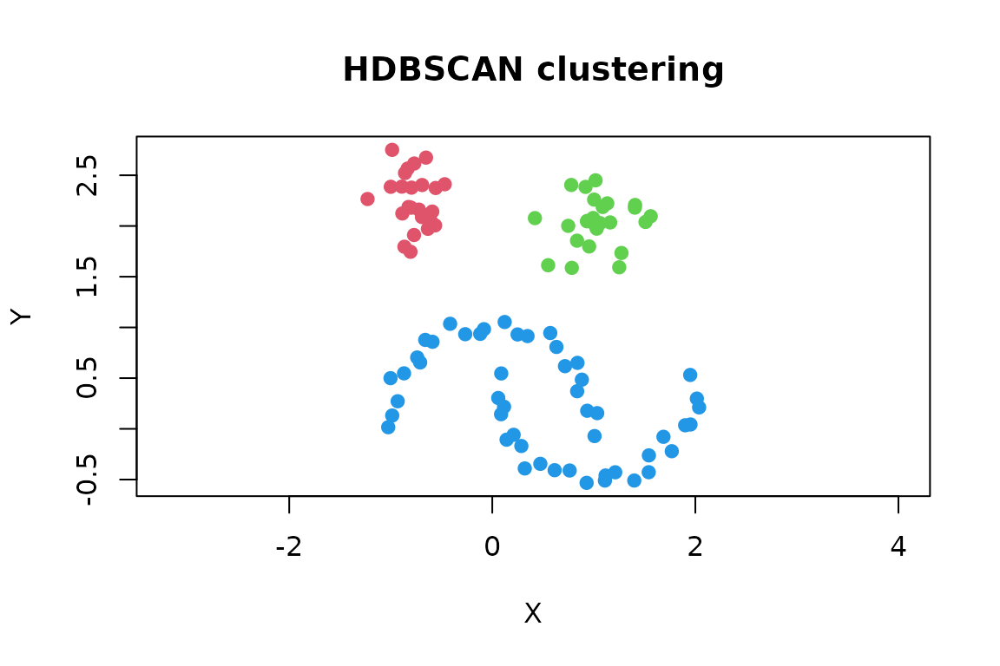

# Getting started with dbscan

The **dbscan** package provides fast implementations of density-based
clustering algorithms. These algorithms can find clusters with irregular
shapes and identify observations in sparse regions as noise. This
vignette introduces the usual workflow with DBSCAN and briefly shows
when HDBSCAN or OPTICS may be a better choice.

## Installation

Install the released version from CRAN:

``` r

install.packages("dbscan")
```

Load the package in each R session where you want to use it:

``` r

library(dbscan)
```

## A first clustering

We use the two-dimensional `moons` data included in the package. Each
row is an observation and each column is a numeric feature.

``` r

data("moons")
x <- as.matrix(moons)

plot(x, pch = 19, asp = 1, main = "Moons data")
```


DBSCAN needs two parameters:

- `eps` is the radius of a point’s neighborhood.
- `minPts` is the minimum number of points, including the point itself,
  needed to form a dense region.

``` r

cl <- dbscan(x, eps = 0.45, minPts = 5)
cl
#> DBSCAN clustering for 100 objects.
#> Parameters: eps = 0.45, minPts = 5
#> Using euclidean distances and borderpoints = TRUE
#> The clustering contains 3 cluster(s) and 0 noise points.
#> 
#>  1  2  3 
#> 50 25 25 
#> 
#> Available fields: cluster, eps, minPts, metric, borderPoints
```

The cluster assignment for each observation is stored in `cl$cluster`.
Positive integers are cluster labels and `0` denotes noise. Cluster
numbers are identifiers only; their numeric order has no meaning.

``` r

table(cl$cluster)
#> 
#>  1  2  3 
#> 50 25 25
head(cl$cluster)
#> [1] 1 1 1 1 1 1
```

The labels can be added to the original data or used directly for
plotting.

``` r

clustered <- transform(moons, cluster = factor(cl$cluster))
head(clustered)
#>             X          Y cluster
#> 1 -0.41520756  1.0357347       1
#> 2  0.05878098  0.3043343       1
#> 3  1.10937860 -0.5097378       1
#> 4  1.54094828 -0.4275496       1
#> 5  0.92909498 -0.5323878       1
#> 6 -0.86932470  0.5471548       1
```

``` r

plot(
  x,
  col = cl$cluster + 1L,
  pch = ifelse(cl$cluster == 0, 4, 19),
  asp = 1,
  xlab = "X",
  ylab = "Y",
  main = "DBSCAN clustering"
)
```



With the default R palette, noise is black because its cluster label is
zero.

## Prepare your own data

For the fast default search, supply a numeric matrix or data frame
without missing or infinite values. DBSCAN uses Euclidean distance, so
the scale of the variables matters. A variable measured in large units
can otherwise dominate the distance calculation. Standardizing is often
appropriate when features use different units:

``` r

x <- scale(my_data)
```

Whether scaling is appropriate depends on the meaning of the variables.
Do not include identifiers, labels, or unordered factors as numeric
features. For a non-Euclidean distance, calculate a `dist` object first
and pass it to
[`dbscan()`](http://michael.hahsler.net/dbscan/reference/dbscan.md);
this does not use the fast kd-tree search.

## Choose `minPts` and `eps`

There is no single best parameter setting for every data set. A useful
starting point is:

1.  Choose `minPts` based on the smallest dense group that should count
    as a cluster. For low-dimensional data, the number of dimensions
    plus one is a common lower bound; larger values produce smoother,
    more conservative results.
2.  Inspect the sorted distance to each point’s `minPts - 1` nearest
    neighbor.
3.  Choose `eps` near a visible bend where the distances begin to
    increase rapidly.

[`kNNdistplot()`](http://michael.hahsler.net/dbscan/reference/kNNdist.md)
performs the second step. Supplying `minPts` automatically uses
`k = minPts - 1` because a DBSCAN neighborhood also counts the point
itself.

``` r

kNNdistplot(x, minPts = 5)
abline(h = 0.45, col = 2, lty = 2)
```


The bend is a guide rather than an automatic rule. Refit the model with
a few nearby values and check whether the important structure is stable:

``` r

settings <- c(0.40, 0.45, 0.50)
fits <- lapply(
  settings,
  function(e) dbscan(x, eps = e, minPts = 5)
)

data.frame(
  eps = settings,
  clusters = vapply(fits, function(fit) max(fit$cluster), integer(1)),
  noise = vapply(fits, function(fit) sum(fit$cluster == 0), integer(1))
)
#>    eps clusters noise
#> 1 0.40        4     0
#> 2 0.45        3     0
#> 3 0.50        3     0
```

Increasing `eps` tends to merge clusters and label fewer points as
noise. Increasing `minPts` makes the density requirement stricter.
Domain knowledge and the intended use of the clusters should guide the
final choice.

## Assign new observations

Although DBSCAN does not learn a conventional prediction model, the
package can assign a new observation to the cluster of its nearest
non-noise training point within `eps`. If no such point exists, it is
assigned to noise.

``` r

new_points <- rbind(
  c(0.0, 0.0),
  c(1.0, 2.0),
  c(4.0, 4.0)
)

predict(cl, newdata = new_points, data = x)
#> [1] 1 2 0
```

When training data were transformed, apply the same transformation to
new observations before prediction. Also keep the original training
matrix: it is required by
[`predict()`](https://rdrr.io/r/stats/predict.html).

## When DBSCAN is not the best starting point

The package contains several related algorithms:

| Algorithm | Useful when |
|:---|:---|
| [`dbscan()`](http://michael.hahsler.net/dbscan/reference/dbscan.md) | Clusters have roughly similar density and one meaningful neighborhood radius can be chosen. |
| [`hdbscan()`](http://michael.hahsler.net/dbscan/reference/hdbscan.md) | Clusters may have different densities or you want to avoid choosing a global `eps`. |
| [`optics()`](http://michael.hahsler.net/dbscan/reference/optics.md) | You want to explore clustering structure over a range of neighborhood radii. |

HDBSCAN requires only `minPts` for a basic analysis and extracts stable
clusters from a density hierarchy:

``` r

hdb <- hdbscan(x, minPts = 5)
hdb
#> HDBSCAN clustering for 100 objects.
#> Parameters: minPts = 5
#> The clustering contains 3 cluster(s) and 0 noise points.
#> 
#>  1  2  3 
#> 25 25 50 
#> 
#> Available fields: cluster, minPts, coredist, cluster_scores,
#>                   membership_prob, outlier_scores, hc

plot(
  x,
  col = hdb$cluster + 1L,
  pch = ifelse(hdb$cluster == 0, 4, 19),
  asp = 1,
  main = "HDBSCAN clustering"
)
```



The HDBSCAN result also contains membership strengths, outlier scores,
and a cluster hierarchy. See
[`vignette("hdbscan", package = "dbscan")`](http://michael.hahsler.net/dbscan/articles/hdbscan.md)
for a more detailed introduction.

OPTICS creates an ordering whose reachability plot exposes clustering
structure. Valleys in the plot correspond to dense groups. A DBSCAN-like
clustering can then be extracted at different thresholds without
rerunning OPTICS.

``` r

opt <- optics(x, minPts = 5)
plot(opt)
```


``` r


opt_cl <- extractDBSCAN(opt, eps_cl = 0.45)
table(opt_cl$cluster)
#> 
#>  1  2  3 
#> 50 25 25
```

## Next steps

Useful help pages include:

- [`?dbscan`](http://michael.hahsler.net/dbscan/reference/dbscan.md) for
  DBSCAN options, core-point detection, and more examples;
- [`?hdbscan`](http://michael.hahsler.net/dbscan/reference/hdbscan.md)
  and [`?optics`](http://michael.hahsler.net/dbscan/reference/optics.md)
  for hierarchical and multi-scale clustering;
- [`?kNN`](http://michael.hahsler.net/dbscan/reference/kNN.md) and
  [`?frNN`](http://michael.hahsler.net/dbscan/reference/frNN.md) for
  fast nearest-neighbor search;
- [`?lof`](http://michael.hahsler.net/dbscan/reference/lof.md) and
  [`?glosh`](http://michael.hahsler.net/dbscan/reference/glosh.md) for
  outlier scoring; and
- [`?dbcv`](http://michael.hahsler.net/dbscan/reference/dbcv.md) for
  density-based cluster validation.

For a citable description of the algorithms and implementation, use
`citation("dbscan")`.
