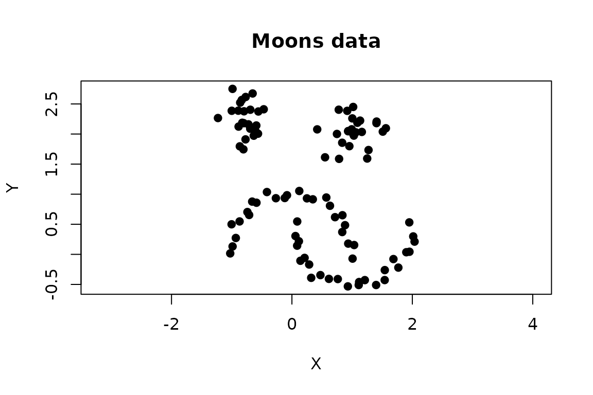
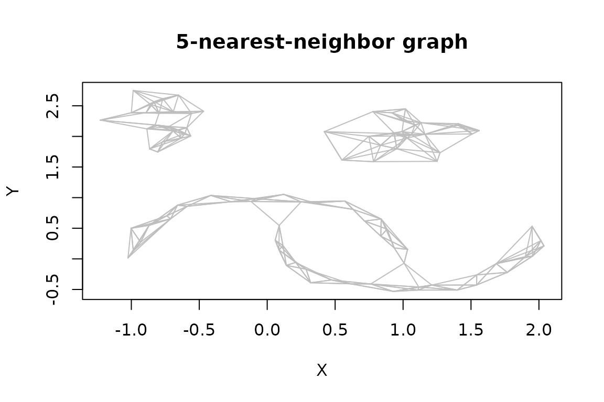
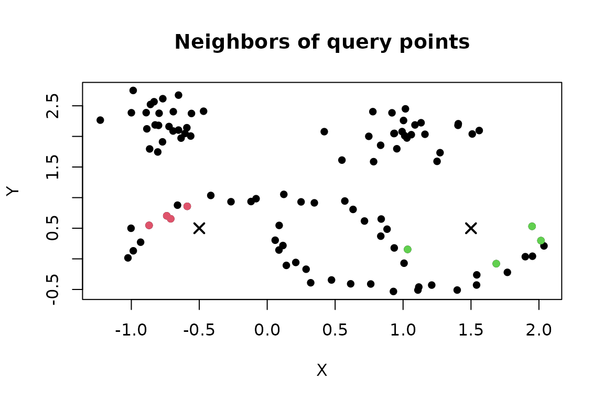
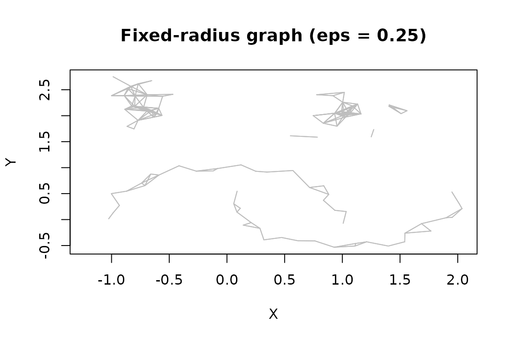
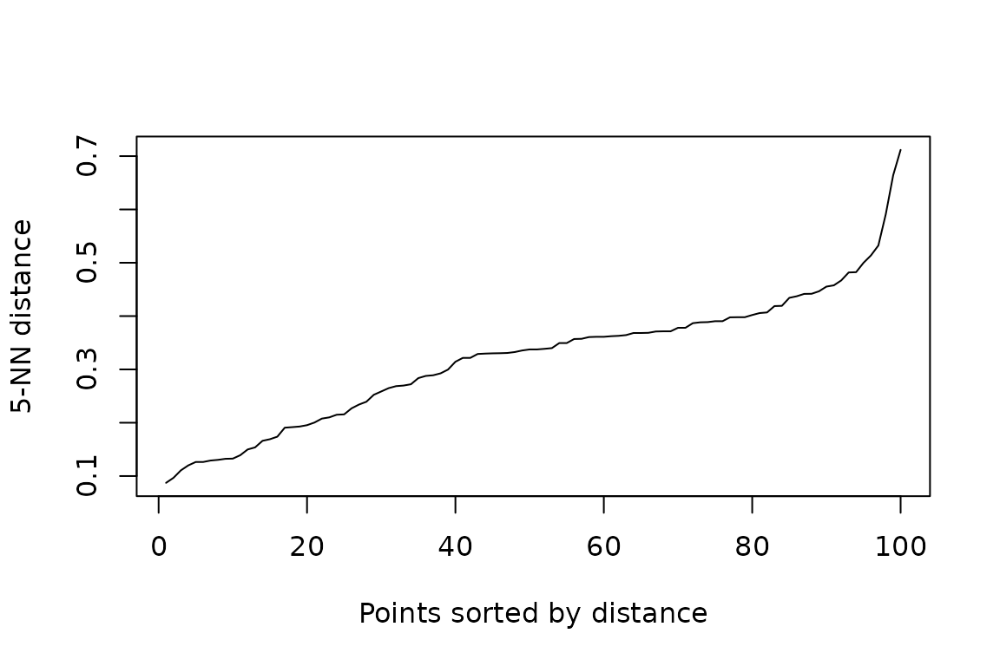
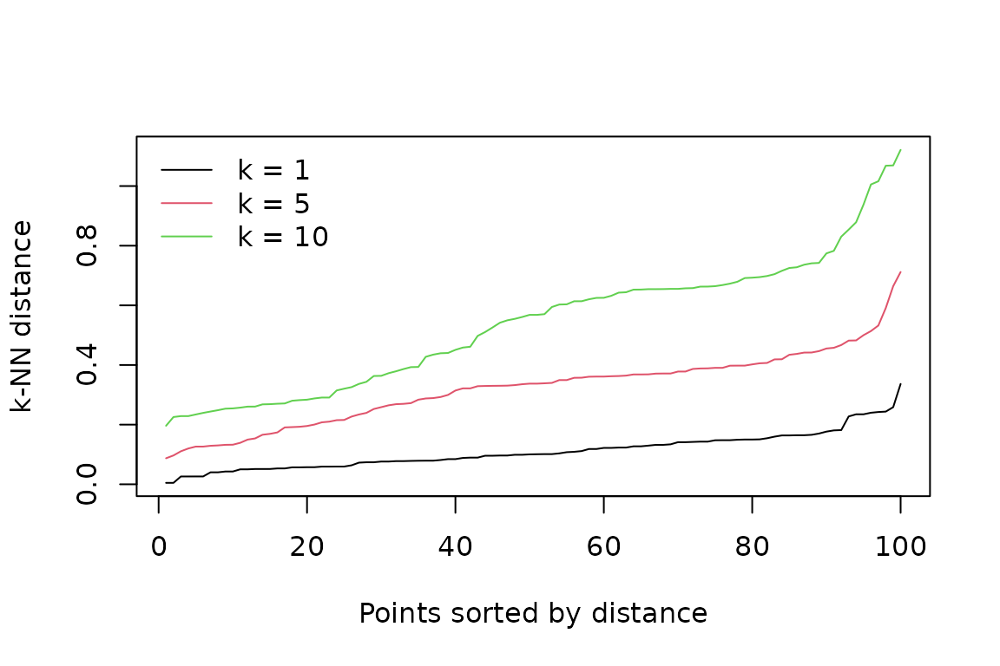
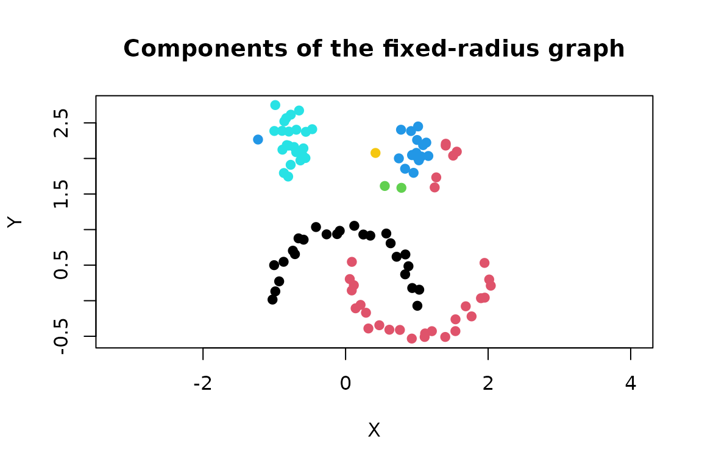

# Nearest-Neighbor Search and Graphs

Nearest-neighbor search is the computational foundation for the
clustering and outlier-detection algorithms in **dbscan**. Many
algorithms define neighborhoods using a `minPts` parameter. The
neighborhood typically includes the point at the center as well, while
`kNN` algorithms do not it in `k`. Therefore, we have `k = minPts - 1`
when we go from clustering to `kNN` search.

The package exposes `kNN` search algorithms and resulting graphs
directly:

| Function | Neighborhood | Result structure |
|:---|:---|:---|
| [`kNN()`](http://michael.hahsler.net/dbscan/reference/kNN.md) | The `k` closest observations | Matrices of neighbor IDs and distances |
| [`frNN()`](http://michael.hahsler.net/dbscan/reference/frNN.md) | All observations no farther than `eps` | Lists of neighbor IDs and distances |
| [`sNN()`](http://michael.hahsler.net/dbscan/reference/sNN.md) | Similarity based on shared nearest neighbors | Matrices of IDs, distances, and shared-neighbor counts |
| [`kNNdist()`](http://michael.hahsler.net/dbscan/reference/kNNdist.md) | Distance to the kth nearest neighbor | Numeric vector, or a distance matrix for several neighbors |
| [`kNNdistplot()`](http://michael.hahsler.net/dbscan/reference/kNNdist.md) | Sorted kth-neighbor distances | Diagnostic plot |

Objects returned by the first three functions inherit from class `NN`.
They support [`print()`](https://rdrr.io/r/base/print.html),
[`sort()`](https://rdrr.io/r/base/sort.html),
[`plot()`](https://rdrr.io/r/graphics/plot.default.html),
[`adjacencylist()`](http://michael.hahsler.net/dbscan/reference/NN.md),
and [`comps()`](http://michael.hahsler.net/dbscan/reference/comps.md)
for finding connected components.

Nearest neighbor search is optimized for Euclidean distance where it
used kd-tree implemented in the ANN library (Mount and Arya, 2010).

## Example data

We use the two-dimensional `moons` data included with the package. Row
names make it easier to follow neighbor IDs in the output.

``` r

data("moons")
x <- as.matrix(moons)
rownames(x) <- paste0("p", seq_len(nrow(x)))

plot(x, pch = 19, asp = 1, main = "Moons data")
```



For a numeric matrix or data frame, the functions use Euclidean
distance. Variable scales therefore determine which observations are
considered close. Standardize variables when their units are not
comparable and equal weighting is appropriate for the application.

## k nearest neighbors

[`kNN()`](http://michael.hahsler.net/dbscan/reference/kNN.md) finds
exactly `k` neighbors for every observation. Self-matches are removed
when searching the rows of `x` against themselves.

``` r

knn5 <- kNN(x, k = 5)
knn5
#> k-nearest neighbors for 100 objects (k=5).
#> Distance metric: euclidean 
#> 
#> Available fields: dist, id, k, sort, metric

head(knn5$id)
#>     1  2  3  4  5
#> p1 28 35 24 22 34
#> p2 25 16 49 38 18
#> p3 43 15  5  7 50
#> p4  7 33 17 15 26
#> p5  3 43 50 15 23
#> p6 11 29 31  8 24
head(knn5$dist)
#>             1         2         3         4         5
#> p1 0.18067805 0.2482587 0.2919872 0.3124803 0.3374657
#> p2 0.10363167 0.1625177 0.2437245 0.3933766 0.4192075
#> p3 0.05012376 0.1300946 0.1817009 0.2890157 0.3611383
#> p4 0.16447171 0.1658502 0.3071653 0.3301279 0.3780511
#> p5 0.18170087 0.2001416 0.2066729 0.3003437 0.3385849
#> p6 0.14116165 0.1917604 0.2031767 0.2820457 0.3904264
```

Rows correspond to observations in `x`, and columns are ordered from
nearest to farthest when `sort = TRUE`, the default. IDs are row
positions in `x`; row names are retained as matrix row names. For
example, the neighbors and distances for observation 10 are:

``` r

i <- 10
data.frame(
  id = knn5$id[i, ],
  row_name = rownames(x)[knn5$id[i, ]],
  distance = knn5$dist[i, ]
)
#>   id row_name  distance
#> 1 23      p23 0.1543851
#> 2 30      p30 0.1596991
#> 3 45      p45 0.2567342
#> 4 50      p50 0.2962318
#> 5 38      p38 0.3887138
```

A `kNN` object represents a directed graph: observation `j` can be among
the nearest neighbors of `i` without `i` being among the nearest
neighbors of `j`.
[`adjacencylist()`](http://michael.hahsler.net/dbscan/reference/NN.md)
returns the graph as a list of integer vectors.

``` r

knn_adj <- adjacencylist(knn5)
knn_adj[1:3]
#> [[1]]
#>  1  2  3  4  5 
#> 28 35 24 22 34 
#> 
#> [[2]]
#>  1  2  3  4  5 
#> 25 16 49 38 18 
#> 
#> [[3]]
#>  1  2  3  4  5 
#> 43 15  5  7 50
```

The graph can be plotted for small, low-dimensional data. The first two
data columns are used as coordinates.

``` r

plot(knn5, x, pch = 19, main = "5-nearest-neighbor graph")
```



### Reuse and reduce a search

A stored search can be reduced without rebuilding the kd-tree. This is
useful when an analysis needs several values of `k`: calculate the
largest required neighborhood once and retain its leading columns.

``` r

knn10 <- kNN(x, k = 10)
knn3 <- kNN(knn10, k = 3)

c(stored = knn10$k, reduced = knn3$k)
#>  stored reduced 
#>      10       3
head(knn3$id)
#>     1  2  3
#> p1 28 35 24
#> p2 25 16 49
#> p3 43 15  5
#> p4  7 33 17
#> p5  3 43 50
#> p6 11 29 31
```

The requested `k` cannot exceed the number stored in the input object. A
new search is required to enlarge it.

### Query new points

Use `query` to find neighbors in reference data `x` for a different set
of points. The output has one row per query point, and neighbor IDs
still refer to rows of `x`.

``` r

query <- rbind(
  left = c(-0.5, 0.5),
  right = c(1.5, 0.5)
)

query_knn <- kNN(x, k = 4, query = query)
query_knn$id
#>        1  2  3  4
#> left  29 31 35  6
#> right 12 20 48 26
query_knn$dist
#>               1         2         3         4
#> left  0.2610225 0.3140678 0.3690005 0.3723229
#> right 0.4504389 0.5530469 0.5804156 0.6075881
```

Plotting a query result colors the reference observations selected for
each query. The query points are added as crosses.

``` r

plot(query_knn, x, col = "grey70", main = "Neighbors of query points")
points(query, pch = 4, lwd = 2, cex = 1.3)
```



Self-matches are not automatically removed in query mode. Thus, if a
query row is identical to a reference row, that reference observation
can be returned at distance zero.

## Fixed-radius nearest neighbors

[`frNN()`](http://michael.hahsler.net/dbscan/reference/frNN.md) finds
every observation within radius `eps`. Since neighborhood sizes vary,
IDs and distances are stored as parallel lists rather than matrices.
Self-matches are excluded.

``` r

fr <- frNN(x, eps = 0.25)
fr
#> fixed radius nearest neighbors for 100 objects (eps=0.25).
#> Distance metric: euclidean 
#> 
#> Available fields: dist, id, eps, metric, sort

fr$id[1:3]
#> $p1
#> [1] 28 35
#> 
#> $p2
#> [1] 25 16 49
#> 
#> $p3
#> [1] 43 15  5
fr$dist[1:3]
#> $p1
#> [1] 0.1806781 0.2482587
#> 
#> $p2
#> [1] 0.1036317 0.1625177 0.2437245
#> 
#> $p3
#> [1] 0.05012376 0.13009457 0.18170087
summary(lengths(fr$id))
#>    Min. 1st Qu.  Median    Mean 3rd Qu.    Max. 
#>    0.00    2.00    3.00    4.04    6.00   11.00
```

The adjacency-list representation is already stored in `id`, so
`adjacencylist(fr)` returns that list. Empty integer vectors identify
observations with no other point inside the radius.

``` r

identical(adjacencylist(fr), fr$id)
#> [1] TRUE
which(lengths(fr$id) == 0L)
#>  p79 p100 
#>   79  100
```

Like a kNN graph, a fixed-radius graph can be plotted.

``` r

plot(fr, x, pch = 19, main = "Fixed-radius graph (eps = 0.25)")
```



### Reduce a stored radius

A fixed-radius result can be filtered to a smaller radius without
repeating the search. Start with the largest radius that later analyses
will need.

``` r

fr_wide <- frNN(x, eps = 0.30)
fr_small <- frNN(fr_wide, eps = 0.12)

c(wide_edges = sum(lengths(fr_wide$id)),
  small_edges = sum(lengths(fr_small$id)))
#>  wide_edges small_edges 
#>         558         108
```

The new radius cannot exceed the radius stored in the object.
Fixed-radius queries use the same `query` interface as
[`kNN()`](http://michael.hahsler.net/dbscan/reference/kNN.md).

``` r

query_fr <- frNN(x, eps = 0.25, query = query)
data.frame(
  query = rownames(query),
  neighbors = lengths(query_fr$id)
)
#>       query neighbors
#> left   left         0
#> right right         0
```

## Shared nearest neighbors

[`sNN()`](http://michael.hahsler.net/dbscan/reference/sNN.md) starts
with a k-nearest-neighbor search and counts neighborhood overlap. Each
observation is treated as belonging to its own neighborhood for this
calculation. The `shared` matrix aligns with `id`: `shared[i, j]` is the
similarity between observation `i` and the neighbor stored in
`id[i, j]`.

``` r

snn <- sNN(x, k = 10)
snn
#> shared-nearest neighbors for 100 objects (k=10, kt=NULL).
#> Available fields: dist, id, k, sort, metric, shared, sort_shared

head(snn$id, 3)
#>     1  2  3  4  5  6  7  8  9 10
#> p1 28 22 24 35 29 31 34  6 40  9
#> p2 25 49 16 18 38 45  9 13 22 34
#> p3  5 43  7 15 47 50  4 23 33 10
head(snn$shared, 3)
#>      [,1] [,2] [,3] [,4] [,5] [,6] [,7] [,8] [,9] [,10]
#> [1,]    9    8    8    8    7    7    7    6    5     4
#> [2,]    7    7    6    6    6    5    4    4    4     4
#> [3,]    9    9    8    8    7    7    6    6    6     5
table(snn$shared)
#> 
#>   0   1   2   3   4   5   6   7   8   9  10 
#>   2   7   4  17  41 130 153 177 237 170  62
```

By default, rows are sorted by decreasing shared-neighbor count.
Distances and IDs are rearranged with the counts, so the columns are no
longer necessarily ordered by Euclidean distance.

Set `kt` to retain only graph edges with at least that many shared
neighbors. Removed entries are represented by `NA` and are omitted by
[`adjacencylist()`](http://michael.hahsler.net/dbscan/reference/NN.md).

``` r

snn5 <- sNN(snn, kt = 5)
snn5$id[1:3, ]
#>     1  2  3  4  5  6  7  8  9 10
#> p1 28 22 24 35 29 31 34  6 40 NA
#> p2 25 49 16 18 38 45 NA NA NA NA
#> p3  5 43  7 15 47 50  4 23 33 10
adjacencylist(snn5)[1:3]
#> [[1]]
#>  1  2  3  4  5  6  7  8  9 
#> 28 22 24 35 29 31 34  6 40 
#> 
#> [[2]]
#>  1  2  3  4  5  6 
#> 25 49 16 18 38 45 
#> 
#> [[3]]
#>  1  2  3  4  5  6  7  8  9 10 
#>  5 43  7 15 47 50  4 23 33 10
```

With `jp = TRUE`, an edge receives a nonzero similarity only when the
two observations are in each other’s nearest-neighbor lists. This
mutual-neighbor rule is used by Jarvis–Patrick clustering and by the
package’s SNN clustering implementation.

``` r

snn_mutual <- sNN(knn10, k = 10, jp = TRUE)
c(
  all_edges = sum(!is.na(snn$id)),
  mutual_edges = sum(snn_mutual$shared > 0)
)
#>    all_edges mutual_edges 
#>         1000          770
```

Passing a precomputed `kNN` object, as above, avoids repeating the
neighbor search. Shared-neighbor clustering is covered separately in the
[`vignette("nnclustering")`](http://michael.hahsler.net/dbscan/articles/nnclustering.md)
vignette.

## Neighbor-distance diagnostics

[`kNNdist()`](http://michael.hahsler.net/dbscan/reference/kNNdist.md)
returns the distance from each observation to its kth nearest neighbor
in original row order.

``` r

d5 <- kNNdist(x, k = 5)
head(d5)
#>        p1        p2        p3        p4        p5        p6 
#> 0.3374657 0.4192075 0.3611383 0.3780511 0.3385849 0.3904264
summary(d5)
#>    Min. 1st Qu.  Median    Mean 3rd Qu.    Max. 
#> 0.08724 0.22412 0.33747 0.32142 0.39043 0.71178
```

Use `all = TRUE` to retain the distances to every neighbor from 1
through `k`.

``` r

d_all <- kNNdist(x, k = 5, all = TRUE)
head(d_all)
#>             1         2         3         4         5
#> p1 0.18067805 0.2482587 0.2919872 0.3124803 0.3374657
#> p2 0.10363167 0.1625177 0.2437245 0.3933766 0.4192075
#> p3 0.05012376 0.1300946 0.1817009 0.2890157 0.3611383
#> p4 0.16447171 0.1658502 0.3071653 0.3301279 0.3780511
#> p5 0.18170087 0.2001416 0.2066729 0.3003437 0.3385849
#> p6 0.14116165 0.1917604 0.2031767 0.2820457 0.3904264
```

[`kNNdistplot()`](http://michael.hahsler.net/dbscan/reference/kNNdist.md)
sorts these values and plots them. A sharp increase can suggest a range
for the DBSCAN radius: points before the increase have nearby neighbors,
while points in the upper tail are relatively isolated.

``` r

kNNdistplot(x, k = 5)
```



Several neighborhood sizes can be compared in one plot.

``` r

kNNdistplot(x, k = c(1, 5, 10))
legend("topleft", legend = c("k = 1", "k = 5", "k = 10"),
       col = 1:3, lty = 1, bty = "n")
```



For selecting `eps` for DBSCAN, `minPts` can be supplied instead. DBSCAN
counts the point itself, while
[`kNNdist()`](http://michael.hahsler.net/dbscan/reference/kNNdist.md)
excludes it, so `kNNdistplot(x, minPts = 6)` uses `k = 5`.

``` r

kNNdistplot(x, minPts = 6)
```


The knee is a diagnostic, not an automatic parameter estimate. It may be
unclear for data containing groups with different densities.

## Connected components

[`comps()`](http://michael.hahsler.net/dbscan/reference/comps.md) finds
connected components in an `NN` graph. In a kNN graph, `mutual = FALSE`
treats a one-directional neighbor relation as sufficient for a
connection; `mutual = TRUE` requires both observations to list each
other.

``` r

comp_directed <- comps(knn3, mutual = FALSE)
comp_mutual <- comps(knn3, mutual = TRUE)

c(
  components_any_direction = length(unique(comp_directed)),
  components_mutual = length(unique(comp_mutual))
)
#> components_any_direction        components_mutual 
#>                        4                       16
```

Fixed-radius graphs are symmetric, so no `mutual` argument is needed.

``` r

fr_comp <- comps(fr)
table(fr_comp)
#> fr_comp
#>   1   2  51  52  53  66  74  79 100 
#>  25  25   2  16  24   4   2   1   1

plot(x, col = fr_comp, pch = 19, asp = 1,
     main = "Components of the fixed-radius graph")
```



Thresholded `sNN` graphs can be handled in the same way.

``` r

snn_comp <- comps(snn5)
table(snn_comp)
#> snn_comp
#>  1  2  3 
#> 50 25 25
```

[`comps()`](http://michael.hahsler.net/dbscan/reference/comps.md) also
accepts a `dist` object and a distance threshold. This is equivalent to
components in the corresponding fixed-radius graph.

``` r

comp_dist <- comps(dist(x), eps = 0.25)
comp_fr <- comps(fr)

# Component numbers are arbitrary; compare which pairs share a component.
all(outer(comp_dist, comp_dist, `==`) ==
      outer(comp_fr, comp_fr, `==`))
#> [1] TRUE
```

## Sorting results

Sorting can be skipped during a search and applied later. This can save
time when an algorithm only needs the set of neighbors. For `frNN`,
[`sort()`](https://rdrr.io/r/base/sort.html) orders each list by
distance; for `kNN`, it orders matrix rows by distance; and for `sNN`,
it orders rows by decreasing shared-neighbor count.

``` r

fr_unsorted <- frNN(x, eps = 0.25, sort = FALSE)
fr_sorted <- sort(fr_unsorted)

data.frame(
  id = fr_sorted$id[[1]],
  distance = fr_sorted$dist[[1]]
)
#>   id  distance
#> 1 28 0.1806781
#> 2 35 0.2482587
```

Setting `decreasing = TRUE` reverses the normal distance order for `kNN`
and `frNN`. The default for `sNN` is already decreasing similarity.

## Using non-Euclidean distances

Supplying a `dist` object allows
[`kNN()`](http://michael.hahsler.net/dbscan/reference/kNN.md),
[`frNN()`](http://michael.hahsler.net/dbscan/reference/frNN.md), and
[`sNN()`](http://michael.hahsler.net/dbscan/reference/sNN.md) to use
another dissimilarity measure. However, this means that the efficient
kd-tree implementation cannot be used.

``` r

d_manhattan <- dist(x, method = "manhattan")

knn_manhattan <- kNN(d_manhattan, k = 5)
fr_manhattan <- frNN(d_manhattan, eps = 0.25)
snn_manhattan <- sNN(d_manhattan, k = 10)

c(
  knn_metric = knn_manhattan$metric,
  frnn_metric = fr_manhattan$metric,
  snn_metric = snn_manhattan$metric
)
#>  knn_metric frnn_metric  snn_metric 
#> "manhattan" "manhattan" "manhattan"
```

A `dist` object stores all pairwise dissimilarities and therefore
requires quadratic memory. It also cannot be used with separate query
points. Check that the selected dissimilarity, transformations, and
variable weights are meaningful for the application.

## Search strategies and performance

For numeric data, the `search` argument offers three strategies:

- `"kdtree"`, the default, builds a kd-tree and is typically the best
  starting point for low- or moderate-dimensional data;
- `"linear"` checks the observations without building a tree; and
- `"dist"` first calculates all pairwise Euclidean distances.

The strategies should agree apart from the selection of tied
observations.

``` r

knn_tree <- kNN(x, k = 5, search = "kdtree")
knn_linear <- kNN(x, k = 5, search = "linear")
knn_dist <- kNN(x, k = 5, search = "dist")

c(
  tree_vs_linear = isTRUE(all.equal(knn_tree$dist, knn_linear$dist)),
  tree_vs_dist = isTRUE(all.equal(knn_tree$dist, knn_dist$dist))
)
#> tree_vs_linear   tree_vs_dist 
#>           TRUE           TRUE
```

`bucketSize` and `splitRule` control construction of the kd-tree. Their
defaults are appropriate for most uses. Setting `approx` above zero
enables approximate search, which can improve speed at the cost of
omitting some true neighbors. Assess the effect on the downstream
analysis before using it.

Kd-trees generally become less effective as dimensionality grows. Linear
search, an application-specific dimension reduction, or a different
distance representation may be preferable in high-dimensional settings.

## Important details

- Input data and query points must be numeric and finite for kd-tree and
  linear search.
- A search of `x` against itself excludes self-matches; query searches
  do not.
- [`kNN()`](http://michael.hahsler.net/dbscan/reference/kNN.md) returns
  exactly `k` observations. If multiple candidates tie at the kth
  distance, one is retained and the others are omitted.
- [`frNN()`](http://michael.hahsler.net/dbscan/reference/frNN.md)
  returns every observation within `eps`, so neighborhood sizes can
  differ and may be zero.
- IDs always refer to row positions in the reference data. Preserve a
  separate stable identifier if rows may later be reordered.

## Reference

Mount, D. M. and Arya, S. (2010). *ANN: A Library for Approximate
Nearest Neighbor Searching*. [ANN project
page](https://www.cs.umd.edu/~mount/ANN/).
