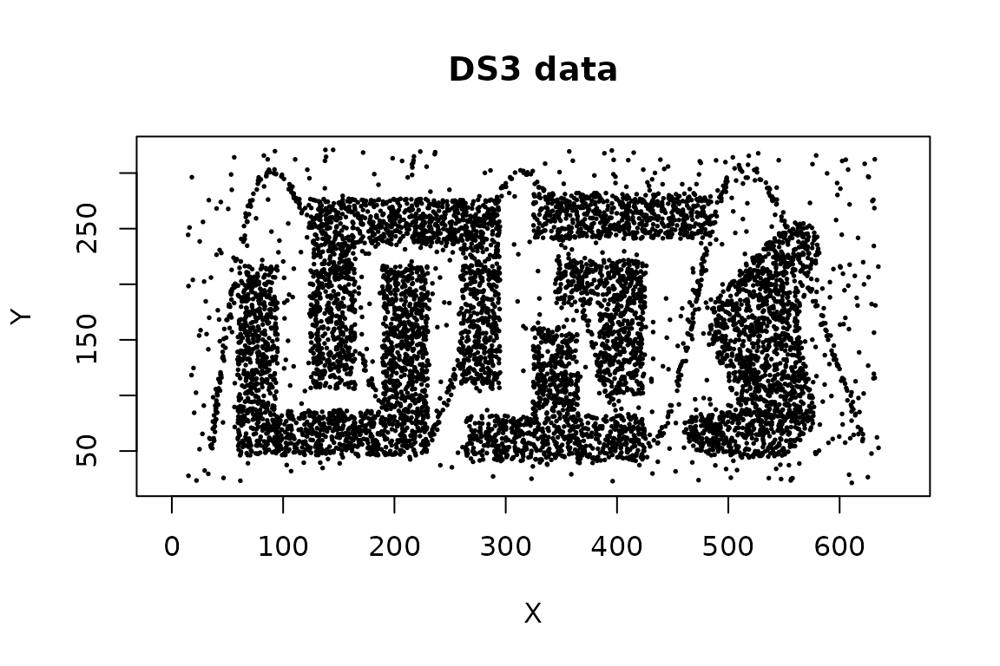

# Nearest-Neighbor Clustering with jpclust and sNNclust

The **dbscan** package implements two clustering algorithms based on
shared nearest neighbors:

- [`jpclust()`](http://michael.hahsler.net/dbscan/reference/jpclust.md)
  implements Jarvis–Patrick clustering; and
- [`sNNclust()`](http://michael.hahsler.net/dbscan/reference/sNNclust.md)
  implements shared nearest neighbor (SNN) clustering with a
  DBSCAN-style density step.

Both algorithms replace the original distances between observations with
a local similarity: two observations are more similar when their lists
of nearest neighbors have a large overlap. This can be useful when
Euclidean distance alone does not describe local cluster structure well,
especially in data with irregular shapes or differing local densities.

## Shared nearest neighbors

For each observation, first find its `k` nearest neighbors. The
shared-neighbor similarity between two observations is the number of
neighbors appearing in both lists. The package treats each observation
as part of its own neighborhood when counting shared neighbors, and the
resulting similarity is between `0` and `k`.

The algorithms use this information differently:

| Function | Link or neighborhood rule | Cluster formation | Noise model |
|:---|:---|:---|:---|
| [`jpclust()`](http://michael.hahsler.net/dbscan/reference/jpclust.md) | Mutual nearest neighbors sharing at least `kt` neighbors | Connected components | No; isolated observations form small clusters |
| [`sNNclust()`](http://michael.hahsler.net/dbscan/reference/sNNclust.md) | Mutual nearest neighbors sharing at least `eps` neighbors | DBSCAN-style core, border, and density-connected points | Yes; label `0` denotes noise |

The thresholds `kt` and `eps` are counts of shared neighbors. In
particular, `eps` in
[`sNNclust()`](http://michael.hahsler.net/dbscan/reference/sNNclust.md)
is not a distance radius and has a different meaning from `eps` in
[`dbscan()`](http://michael.hahsler.net/dbscan/reference/dbscan.md).

## Example data

We use the `DS3` data supplied with the package. It contains six
irregularly-shaped groups together with noise and a sinusoidal structure
that intersects the groups.

``` r

data("DS3")
x <- as.matrix(DS3)

plot(x, pch = 19, cex = 0.25, asp = 1, main = "DS3 data")
```



For numeric matrices and data frames, both functions use Euclidean
distance and fast kd-tree nearest-neighbor search. Variable scales
therefore matter. Standardize variables when their units are not
comparable and scaling is appropriate for the application.

## Jarvis–Patrick clustering

Jarvis–Patrick clustering links two observations when both of the
following conditions hold:

1.  Each observation is in the other’s `k`-nearest-neighbor list.
2.  Their neighborhoods share at least `kt` neighbors.

Connected observations form clusters. Here we use neighborhoods of 20
points and require 12 shared neighbors.

``` r

jp <- jpclust(x, k = 20, kt = 12)
c(clusters = ncluster(jp), noise = nnoise(jp))
#> clusters    noise 
#>       43        0
```

Cluster assignments are stored in `jp$cluster` in the same order as the
rows of `x`. The result also records the algorithm name, distance
metric, and parameters.

``` r

names(jp)
#> [1] "cluster" "type"    "metric"  "param"
jp$param
#> $k
#> [1] 20
#> 
#> $kt
#> [1] 12
head(jp$cluster)
#> [1] 1 1 1 1 2 1
```

The convenience function
[`clplot()`](http://michael.hahsler.net/dbscan/reference/hullplot.md)
marks observations by cluster. It uses the first two columns when the
data have more than two dimensions.

``` r

clplot(x, jp, cex = 0.25, main = "Jarvis-Patrick clustering")
#> Warning in hullplot(x, cl = cl, col = col, pch = pch, cex = cex, main = main, :
#> Not enough colors. Some colors will be reused.
```


Jarvis–Patrick clustering has no explicit concept of noise. Observations
not connected to a larger group become singleton or other small clusters
rather than receiving label `0`. Conversely, a chain of qualifying links
can join larger structures. In this example, the sinusoidal points can
connect groups that otherwise appear separate.

Increasing `kt` makes the link rule stricter. This removes edges from
the shared-neighbor graph and can split clusters or create more small
components. Decreasing `kt` adds edges and can merge clusters through
chaining.

``` r

jp_settings <- c(10, 12, 14)
jp_fits <- lapply(
  jp_settings,
  function(threshold) jpclust(x, k = 20, kt = threshold)
)

data.frame(
  kt = jp_settings,
  clusters = vapply(jp_fits, ncluster, integer(1)),
  singleton_clusters = vapply(
    jp_fits,
    function(fit) sum(table(fit$cluster) == 1L),
    integer(1)
  )
)
#>   kt clusters singleton_clusters
#> 1 10       24                 18
#> 2 12       43                 33
#> 3 14      189                118
```

The required range is `1 <= kt <= k`. A useful setting should preserve
stable, meaningful components without fragmenting the data into many
tiny clusters.

## Shared nearest neighbor clustering

[`sNNclust()`](http://michael.hahsler.net/dbscan/reference/sNNclust.md)
adds a density model to the shared-neighbor graph:

1.  Build `k`-nearest-neighbor lists and their shared-neighbor
    similarities.
2.  Retain mutual-neighbor relationships with similarity at least `eps`.
3.  Treat an observation as a core point if its SNN neighborhood
    contains at least `minPts` points.
4.  Join density-connected core points and optionally assign border
    points.

For the example, two neighbors must share at least 7 of their 20
neighbors, and an observation needs a sufficiently dense SNN
neighborhood of at least 16 points to become a core point.

``` r

snn <- sNNclust(x, k = 20, eps = 7, minPts = 16)
snn
#> SharedNN clustering for 8000 objects.
#> Parameters: k = 20, eps = 7, minPts = 16, borderPoints = 1
#> The clustering contains 10 cluster(s) and 187 noise points.
#> 
#>    0    1    2    3    4    5    6    7    8    9   10 
#>  187 1812  740  998 1770  667 1666   76   49   20   15 
#> 
#> Available fields: cluster, type, param, metric
```

As with DBSCAN, positive integers are arbitrary cluster identifiers and
`0` denotes noise.

``` r

clplot(x, snn, cex = 0.25, main = "Shared nearest neighbor clustering")
#> Warning in hullplot(x, cl = cl, col = col, pch = pch, cex = cex, main = main, :
#> Not enough colors. Some colors will be reused.
```


The parameters control different parts of the algorithm:

- `k` determines the scale at which local neighborhoods are compared.
  Small values emphasize very local structure; large values smooth the
  similarities over a wider neighborhood.
- `eps` is the minimum number of shared neighbors needed for an SNN
  relationship. Increasing it makes similarity more selective.
- `minPts` is the density requirement in the thresholded SNN graph.
  Increasing it makes core-point status more difficult to attain and
  generally produces more noise.
- `borderPoints = TRUE`, the default, assigns non-core observations
  adjacent to a core cluster. Set it to `FALSE` for a core-points-only
  result analogous to DBSCAN\*.

Parameter effects interact, so inspect several nearby settings rather
than selecting each value independently.

``` r

snn_settings <- data.frame(
  eps = c(5, 7, 9),
  minPts = c(16, 16, 16)
)

snn_fits <- lapply(
  seq_len(nrow(snn_settings)),
  function(i) sNNclust(
    x,
    k = 20,
    eps = snn_settings$eps[i],
    minPts = snn_settings$minPts[i]
  )
)

transform(
  snn_settings,
  clusters = vapply(snn_fits, ncluster, integer(1)),
  noise = vapply(snn_fits, nnoise, integer(1))
)
#>   eps minPts clusters noise
#> 1   5     16       10   166
#> 2   7     16       10   187
#> 3   9     16       15   213
```

Cluster counts alone do not identify the best solution. Examine whether
the important groups persist, whether points labeled as noise are
plausible, and whether conclusions are stable under small parameter
changes.

## Reuse a nearest-neighbor search

Nearest-neighbor search can be computed once and reused. This is
especially helpful when comparing algorithms or parameter settings on a
large data set. Compute at least the largest `k` that any later fit will
need.

``` r

nn <- kNN(x, k = 30)

jp_from_nn <- jpclust(nn, k = 20, kt = 12)
snn_from_nn <- sNNclust(nn, k = 20, eps = 7, minPts = 16)

c(
  jp_same = identical(jp$cluster, jp_from_nn$cluster),
  snn_same = identical(snn$cluster, snn_from_nn$cluster)
)
#>  jp_same snn_same 
#>     TRUE     TRUE
```

When the full stored neighborhood should be used, `k` may be omitted
from
[`jpclust()`](http://michael.hahsler.net/dbscan/reference/jpclust.md)
because it can be recovered from the `kNN` object. Keep `k` explicit
when using only the first part of a larger precomputed neighborhood.

## Inspect the shared-neighbor graph

The lower-level
[`sNN()`](http://michael.hahsler.net/dbscan/reference/sNN.md) function
exposes the shared-neighbor calculation. Its `shared` matrix gives the
similarity between each observation and each of its `k` nearest
neighbors.

``` r

shared_nn <- sNN(nn, k = 20, jp = TRUE, sort = FALSE)
shared_nn
#> shared-nearest neighbors for 8000 objects (k=20, kt=NULL).
#> Available fields: dist, id, k, sort, metric, shared, sort_shared
table(shared_nn$shared)
#> 
#>     0     2     3     4     5     6     7     8     9    10    11    12    13 
#> 24250    20    56   204   592  1412  3094  5748  8748 11670 13902 15042 14862 
#>    14    15    16    17    18    19    20 
#> 13934 12872 11042  9236  7134  4646  1536
```

Using `jp = TRUE` reproduces the mutual-neighbor similarity used
internally by
[`sNNclust()`](http://michael.hahsler.net/dbscan/reference/sNNclust.md).
Use this distribution as a diagnostic when selecting a shared-neighbor
threshold. [`sNN()`](http://michael.hahsler.net/dbscan/reference/sNN.md)
can also apply a threshold directly and its graph can be inspected with
[`adjacencylist()`](http://michael.hahsler.net/dbscan/reference/NN.md)
or plotted for small data sets; see
[`?sNN`](http://michael.hahsler.net/dbscan/reference/sNN.md).

## Use a precomputed distance matrix

Both clustering functions also accept a `dist` object. This permits
other distance measures, at the cost of storing all pairwise distances
and giving up the fast kd-tree search.

``` r

d <- dist(my_data, method = "manhattan")

jp_manhattan <- jpclust(d, k = 20, kt = 12)
snn_manhattan <- sNNclust(d, k = 20, eps = 7, minPts = 16)
```

The distance matrix must be finite. Choose a distance measure,
transformations, and scaling based on the meaning of the variables
rather than solely on the resulting number of clusters.

## Which method should you use?

Use
[`jpclust()`](http://michael.hahsler.net/dbscan/reference/jpclust.md)
when a simple connected-components interpretation of mutual
shared-neighbor links is appropriate and small components are
meaningful. Use
[`sNNclust()`](http://michael.hahsler.net/dbscan/reference/sNNclust.md)
when the analysis needs an explicit density requirement, noise labels,
or control over core and border points. For either method, `k` sets the
neighborhood scale and should reflect the smallest local structure that
needs to be retained.

## References

Jarvis, R. A. and Patrick, E. A. (1973). Clustering Using a Similarity
Measure Based on Shared Near Neighbors. *IEEE Transactions on
Computers*, 22(11), 1025–1034.
[doi:10.1109/T-C.1973.223640](https://doi.org/10.1109/T-C.1973.223640).

Ertoz, L., Steinbach, M., and Kumar, V. (2003). Finding Clusters of
Different Sizes, Shapes, and Densities in Noisy, High Dimensional Data.
*Proceedings of the 2003 SIAM International Conference on Data Mining*,
47–58.
[doi:10.1137/1.9781611972733.5](https://doi.org/10.1137/1.9781611972733.5).
