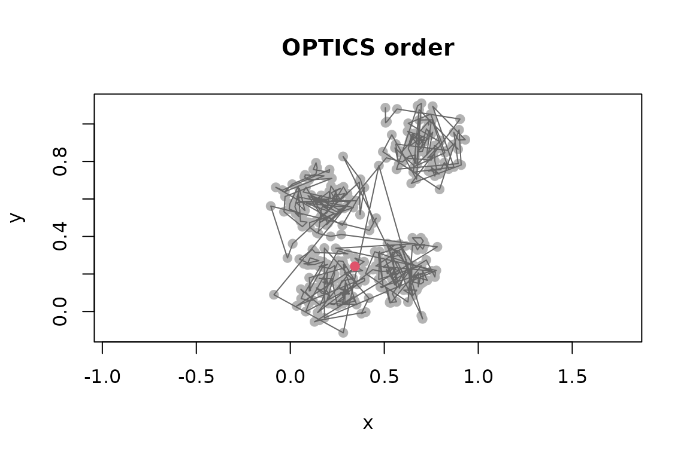
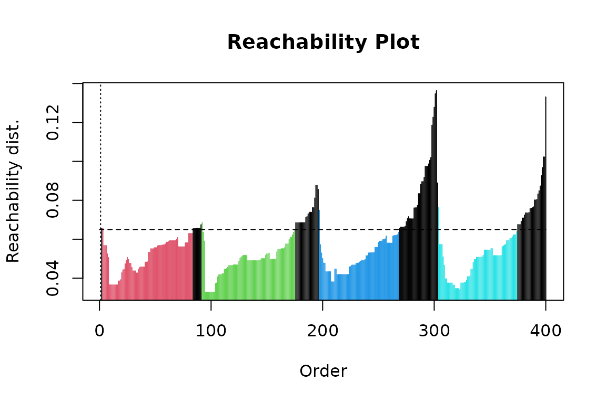
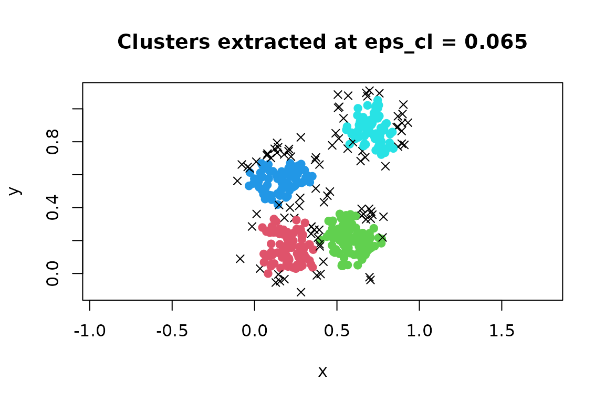
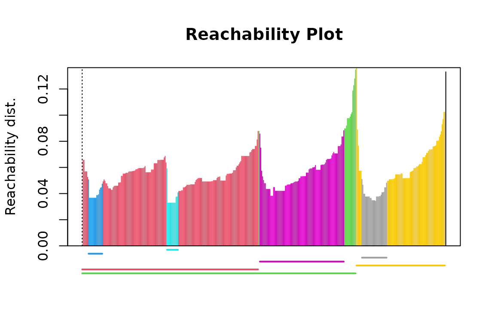
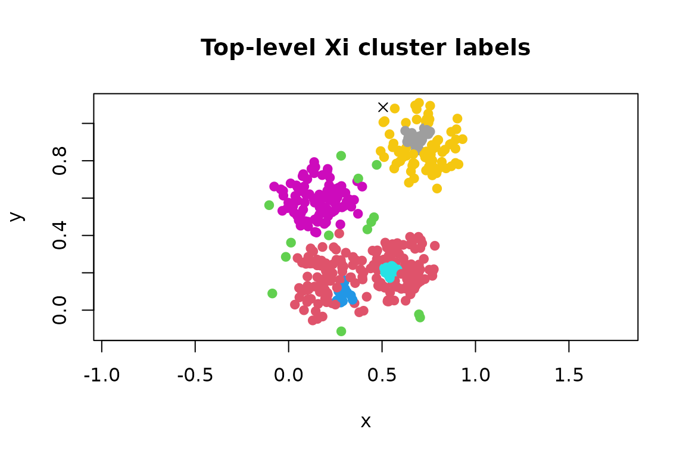

# Ordering Points With OPTICS

OPTICS (Ordering Points To Identify the Clustering Structure) is a
density-based ordering algorithm. Like DBSCAN, it describes dense
regions in terms of an epsilon neighborhood and a minimum number of
points. Unlike DBSCAN, its main result is not a single clustering.
OPTICS orders observations and records their reachability distances,
revealing clustering structure over a range of density levels.

This vignette shows how to create and interpret an OPTICS ordering and
how to extract flat or hierarchical clusters from it.

## Create an OPTICS ordering

We generate four compact groups for a small reproducible example.

``` r

set.seed(2)
n <- 400
x <- cbind(
  x = runif(4, 0, 1) + rnorm(n, sd = 0.1),
  y = runif(4, 0, 1) + rnorm(n, sd = 0.1)
)

plot(x, pch = 19, asp = 1, main = "Example data")
```


[`optics()`](http://michael.hahsler.net/dbscan/reference/optics.md)
accepts a numeric matrix or data frame. For numeric data it uses
Euclidean distance and a fast kd-tree search.

``` r

opt <- optics(x, minPts = 10)
opt
#> OPTICS ordering/clustering for 400 objects.
#> Parameters: minPts = 10, eps = 0.192510979570566, eps_cl = NA, xi = NA
#> Available fields: order, reachdist, coredist, predecessor, minPts, eps,
#>                   eps_cl, xi
```

The most important result components are:

- `order`: row numbers of the observations in OPTICS order;
- `reachdist`: each observation’s reachability distance; and
- `coredist`: each observation’s core distance.

The distance vectors use the original row order. For example,
reachability distances in OPTICS order are obtained with:

``` r

head(opt$order, 10)
#>  [1]   1 363 209 349 337 301 357 333 321 285
head(opt$reachdist[opt$order], 10)
#>  [1]        Inf 0.06559013 0.06559013 0.05673844 0.05673844 0.05673844
#>  [7] 0.05246930 0.05056201 0.03653219 0.03653219
```

The first reachability distance is undefined because the first point has
no predecessor. It is stored as `Inf`.

## Read the reachability plot

Plotting an OPTICS object produces a reachability plot. Each vertical
bar is one observation, arranged in OPTICS order rather than input
order.

``` r

plot(opt)
```


Low-reachability valleys represent dense groups. Peaks separate groups,
and deeper valleys represent denser structure. The plot is therefore
best read as a density landscape, not as a scatter plot or a sequence in
the original data.

The ordering can also be displayed in the original coordinate space.
This is mainly useful for understanding the algorithm; the reachability
plot is usually clearer for real data.

``` r

plot(x, col = "grey70", pch = 19, asp = 1, main = "OPTICS order")
lines(x[opt$order, ], col = "grey40")
points(x[opt$order[1], , drop = FALSE], pch = 19, col = 2)
```



## Choose `minPts` and `eps`

`minPts` controls the scale at which density is evaluated. It includes
the point itself, so `minPts = 10` uses the distance to the ninth other
nearest neighbor for the core-distance calculation. Larger values
average over larger neighborhoods and generally produce a smoother
reachability plot; smaller values reveal finer structure but are more
sensitive to local variation.

In OPTICS, `eps` is the maximum neighborhood radius explored by the
algorithm. It is primarily a computational upper bound, not usually the
density threshold used to define the final clusters. The default
`eps = Inf` lets the package estimate a sufficient finite radius from
the data and `minPts`.

For large data sets, supplying a smaller upper bound can reduce
computation, but it must not exclude structure of interest. Multiple
dashed bars in the reachability plot indicate undefined distances and
usually mean that `eps` is too small. The first dashed bar is expected.

As with other distance-based methods, variable scales matter.
Standardize variables when their units are not comparable and scaling is
substantively appropriate.

## Extract a DBSCAN-like clustering

[`extractDBSCAN()`](http://michael.hahsler.net/dbscan/reference/optics.md)
cuts the reachability plot at a global threshold `eps_cl`. This does not
rerun OPTICS, so several thresholds can be explored using the same
ordering. The extraction closely resembles DBSCAN with the same `minPts`
and epsilon, although OPTICS can leave some DBSCAN border points
unassigned.

``` r

opt_db <- extractDBSCAN(opt, eps_cl = 0.065)
opt_db
#> OPTICS ordering/clustering for 400 objects.
#> Parameters: minPts = 10, eps = 0.192510979570566, eps_cl = 0.065, xi = NA
#> The clustering contains 4 cluster(s) and 92 noise points.
#> 
#>  0  1  2  3  4 
#> 92 81 84 72 71 
#> 
#> Available fields: order, reachdist, coredist, predecessor, minPts, eps,
#>                   eps_cl, xi, cluster
plot(opt_db)
```



The dashed horizontal line is the extraction threshold. Bars are colored
by cluster; cluster `0` is noise and appears black with the default
palette. Cluster assignments are stored in original data order.

``` r

table(opt_db$cluster)
#> 
#>  0  1  2  3  4 
#> 92 81 84 72 71

plot(
  x,
  col = opt_db$cluster + 1L,
  pch = ifelse(opt_db$cluster == 0, 4, 19),
  asp = 1,
  main = "Clusters extracted at eps_cl = 0.065"
)
```



Changing the cut illustrates structure at a different density level:

``` r

opt_db_wide <- extractDBSCAN(opt, eps_cl = 0.07)
c(
  clusters = max(opt_db_wide$cluster),
  noise = sum(opt_db_wide$cluster == 0)
)
#> clusters    noise 
#>        3       62
```

Choose `eps_cl <= opt$eps`. A useful threshold crosses stable valleys
below the peaks that separate them. If a single global cut cannot
represent groups of differing density, use the Xi extraction described
next.

## Extract clusters with the Xi method

[`extractXi()`](http://michael.hahsler.net/dbscan/reference/optics.md)
identifies relative steep-down and steep-up regions in the reachability
plot. The `xi` value is the minimum relative change in reachability used
to recognize a boundary. This can find nested clusters and clusters at
different density levels without selecting one global distance
threshold.

``` r

opt_xi <- extractXi(opt, xi = 0.05)
opt_xi
#> OPTICS ordering/clustering for 400 objects.
#> Parameters: minPts = 10, eps = 0.192510979570566, eps_cl = NA, xi = 0.05
#> The clustering contains 7 cluster(s) and 1 noise points.
#> 
#> Available fields: order, reachdist, coredist, predecessor, minPts, eps,
#>                   eps_cl, xi, clusters_xi, cluster
opt_xi$clusters_xi
#>   start end cluster_id
#> 1     1 194          1
#> 2     1 301          2
#> 3     8  23          3
#> 4    94 106          4
#> 5   196 288          5
#> 6   302 399          6
#> 7   308 335          7
plot(opt_xi)
```



Each row of `clusters_xi` gives the start and end positions of a cluster
in OPTICS order. These intervals can be nested. The colored line
segments below the reachability plot show the intervals, while `cluster`
contains a convenient non-nested labeling in original data order for
plotting.

``` r

plot(
  x,
  col = opt_xi$cluster + 1L,
  pch = ifelse(opt_xi$cluster == 0, 4, 19),
  asp = 1,
  main = "Top-level Xi cluster labels"
)
```



Set `minimum = TRUE` to retain minimal clusters that do not contain
other Xi clusters. This is useful when a non-overlapping, fine-grained
solution is needed.

``` r

opt_xi_min <- extractXi(opt, xi = 0.05, minimum = TRUE)
opt_xi_min
#> OPTICS ordering/clustering for 400 objects.
#> Parameters: minPts = 10, eps = 0.192510979570566, eps_cl = NA, xi = 0.05
#> The clustering contains 4 cluster(s) and 250 noise points.
#> 
#> Available fields: order, reachdist, coredist, predecessor, minPts, eps,
#>                   eps_cl, xi, clusters_xi, cluster
```

The predecessor correction is enabled by default and removes a known
artifact of the original Xi extraction procedure. It should normally
remain enabled.

## Convert the ordering to a dendrogram

An OPTICS reachability structure can be represented as a dendrogram.
This is often convenient for smaller data sets or for code that works
with standard R dendrogram objects.

``` r

dend <- as.dendrogram(opt)
plot(dend, leaflab = "none", ylab = "Reachability distance")
```


Conversion requires a complete reachability structure. If OPTICS was run
with an `eps` that is too small, rerun it with a larger value or the
default before converting.

## Predict labels for new observations

Prediction is available only after
[`extractDBSCAN()`](http://michael.hahsler.net/dbscan/reference/optics.md),
because prediction needs a flat clustering and its global `eps_cl`
threshold. Supply the original training data along with the new
observations.

``` r

new_points <- rbind(
  c(0.2, 0.3),
  c(0.8, 0.8),
  c(2.0, 2.0)
)

predict(opt_db, newdata = new_points, data = x)
#> [1] 1 4 0
```

A new observation receives the label of its nearest non-noise training
point within `eps_cl`; otherwise it is labeled `0`. Apply the same
transformations used for the training data to new observations.

## Use another distance measure

To use a distance other than Euclidean distance, calculate a `dist`
object and pass it to
[`optics()`](http://michael.hahsler.net/dbscan/reference/optics.md).
This uses the supplied pairwise distances rather than the kd-tree
search.

``` r

d <- dist(x, method = "manhattan")
opt_manhattan <- optics(d, minPts = 10)
plot(opt_manhattan)
```

Prediction from a precomputed-distance analysis is not generally
available, because distances from new observations to the training data
are not stored in the `dist` object.

## References

Ankerst, M., Breunig, M. M., Kriegel, H.-P., and Sander, J. (1999).
OPTICS: Ordering Points To Identify the Clustering Structure.
*Proceedings of the 1999 ACM SIGMOD International Conference on
Management of Data*, 49–60.
[doi:10.1145/304181.304187](https://doi.org/10.1145/304181.304187).

Schubert, E. and Gertz, M. (2018). Improving the Cluster Structure
Extracted from OPTICS Plots. *Lernen, Wissen, Daten, Analysen (LWDA
2018)*, 318–329.

Hahsler, M., Piekenbrock, M., and Doran, D. (2019). dbscan: Fast
Density-Based Clustering with R. *Journal of Statistical Software*,
91(1), 1–30.
[doi:10.18637/jss.v091.i01](https://doi.org/10.18637/jss.v091.i01).
