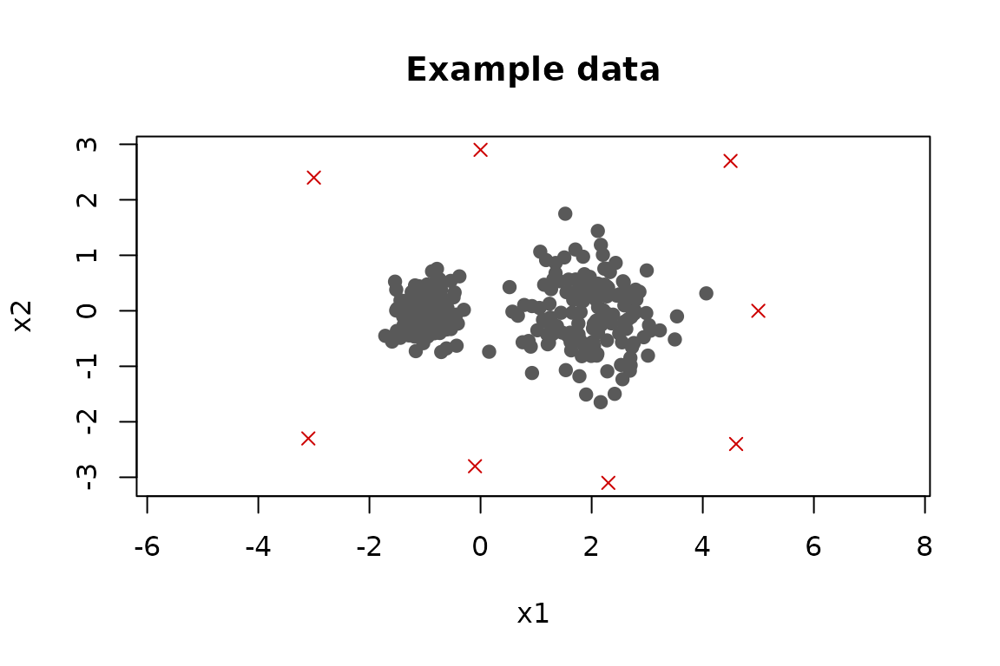
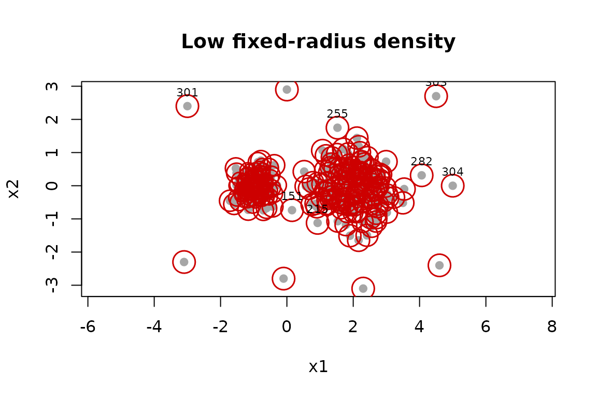
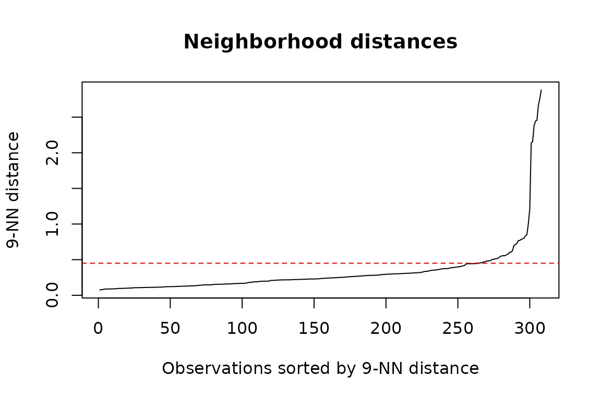
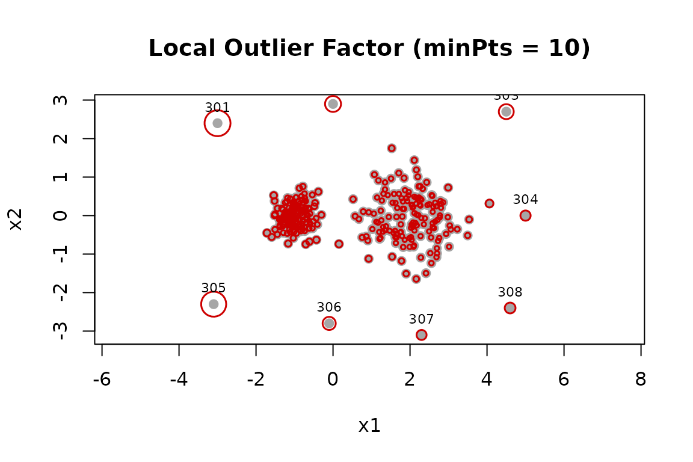
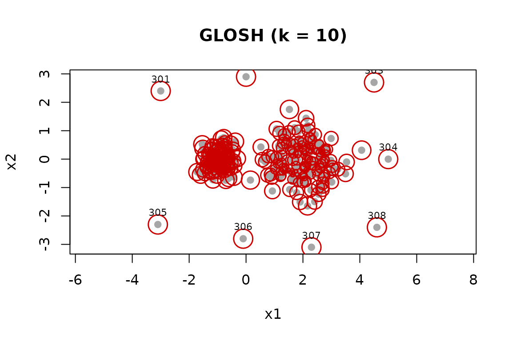
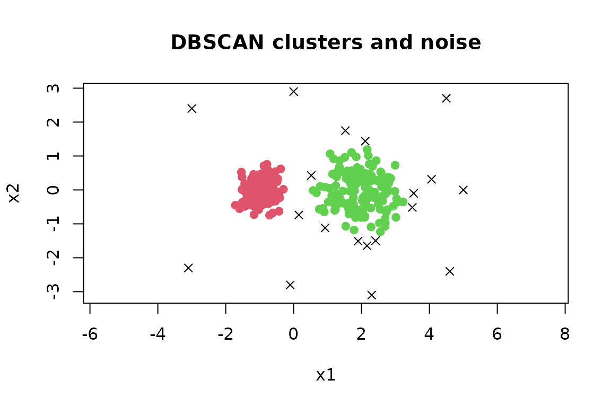

# Outlier Detection with dbscan

The **dbscan** package provides several related approaches to
unsupervised outlier detection:

- [`pointdensity()`](http://michael.hahsler.net/dbscan/reference/pointdensity.md)
  finds observations in low-density regions;
- [`lof()`](http://michael.hahsler.net/dbscan/reference/lof.md) compares
  the density around an observation with the densities around its
  neighbors; and
- [`glosh()`](http://michael.hahsler.net/dbscan/reference/glosh.md) uses
  a density hierarchy to find both local and global outliers. The same
  GLOSH scores are returned by
  [`hdbscan()`](http://michael.hahsler.net/dbscan/reference/hdbscan.md).

These functions return an outlier *score* for every observation, not a
final yes/no decision. This distinction is useful because the number and
cost of false alarms depend on the application. Scores can be ranked for
inspection or combined with a threshold chosen using domain knowledge or
labeled validation data.

## Example data

We create two groups with different densities and add eight unusual
points. The labels are retained only so that the behavior of the methods
can be illustrated; outlier labels are normally not available.

``` r

set.seed(4)

regular <- rbind(
  cbind(rnorm(150, -1, 0.30), rnorm(150, 0, 0.30)),
  cbind(rnorm(150,  2, 0.65), rnorm(150, 0, 0.65))
)
outliers <- rbind(
  c(-3.0,  2.4), c( 0.0,  2.9), c(4.5,  2.7), c(5.0,  0.0),
  c(-3.1, -2.3), c(-0.1, -2.8), c(2.3, -3.1), c(4.6, -2.4)
)
x <- rbind(regular, outliers)
known_outlier <- seq_len(nrow(x)) > nrow(regular)

plot(
  x,
  pch = ifelse(known_outlier, 4, 19),
  col = ifelse(known_outlier, "red3", "grey35"),
  asp = 1,
  xlab = "x1", ylab = "x2",
  main = "Example data"
)
```



All methods in this vignette are distance based. Variables should
therefore be on comparable scales. For measurements in different units,
a common starting point is `scale(x)`, provided that giving the
variables equal variance makes sense for the application. Missing and
non-finite values need to be handled before calculating scores.

The following helper displays a score by mapping larger values to larger
circles. It also labels the observations with the eight largest scores.

``` r

plot_scores <- function(x, score, main, n = 8) {
  size <- 0.5 + 2.5 * (score - min(score)) / diff(range(score))
  top <- order(score, decreasing = TRUE)[seq_len(n)]
  plot(x, pch = 19, col = "grey65", asp = 1, main = main,
       xlab = "x1", ylab = "x2")
  points(x, pch = 1, col = "red3", cex = size, lwd = 1.5)
  text(x[top, , drop = FALSE], labels = top, pos = 3, cex = 0.7)
  invisible(top)
}
```

## Low point density

[`pointdensity()`](http://michael.hahsler.net/dbscan/reference/pointdensity.md)
counts observations inside a fixed-radius neighborhood. The count
includes the query point itself, so its minimum is one. Small counts
indicate isolated observations.

``` r

frequency <- pointdensity(x, eps = 0.45, type = "frequency")
summary(frequency)
#>    Min. 1st Qu.  Median    Mean 3rd Qu.    Max. 
#>    1.00   17.00   29.00   42.22   72.25  109.00

# Reverse the sign so that larger values consistently mean more unusual.
density_score <- -frequency
plot_scores(x, density_score, "Low fixed-radius density")
```



The radius `eps` defines the scale of the analysis. A small radius marks
more points as isolated, while a large radius can hide small-scale
anomalies. The sorted distances to the nearest neighbors provide a
useful diagnostic for the range of plausible radii.

``` r

d9 <- sort(kNNdist(x, k = 9))
plot(
  d9,
  type = "l",
  xlab = "Observations sorted by 9-NN distance",
  ylab = "9-NN distance",
  main = "Neighborhood distances"
)
abline(h = 0.45, col = "red3", lty = 2)
```



A single fixed radius describes a *global* density level. Consequently,
valid observations from a sparse group can receive lower counts than
observations from a dense group. This is where a local score such as LOF
can be preferable.

The `type` argument can also return a uniform-kernel density estimate
with `type = "density"` or a Gaussian-kernel estimate with
`type = "gaussian"`. For ranking observations, the frequency and
uniform-density results give the same ordering when calculated with the
same `eps`.

## Local Outlier Factor (LOF)

LOF compares the local reachability density of an observation with those
of its nearest neighbors. Values near 1 mean that an observation has
density similar to its neighbors. Values substantially larger than 1
indicate a lower local density and stronger evidence of an outlier.

``` r

lof_score <- lof(x, minPts = 10)
summary(lof_score)
#>    Min. 1st Qu.  Median    Mean 3rd Qu.    Max. 
#>  0.9491  0.9970  1.0465  1.2540  1.1756 10.4059
plot_scores(x, lof_score, "Local Outlier Factor (minPts = 10)")
```



`minPts` includes the observation itself and controls the neighborhood
size. Smaller values emphasize very local deviations and may produce
variable scores. Larger values smooth over a wider neighborhood and may
miss anomalies inside small groups. It is good practice to compare the
highest-ranked observations over several substantively reasonable
values.

``` r

minpts <- c(5, 10, 20, 40)
lof_scores <- sapply(minpts, function(m) lof(x, minPts = m))
colnames(lof_scores) <- paste0("minPts_", minpts)

# How many of the top 12 from minPts = 10 remain in each top-12 list?
reference <- order(lof_scores[, "minPts_10"], decreasing = TRUE)[1:12]
data.frame(
  minPts = minpts,
  overlap = apply(lof_scores, 2, function(s)
    length(intersect(reference, order(s, decreasing = TRUE)[1:12])))
)
#>           minPts overlap
#> minPts_5       5       9
#> minPts_10     10      12
#> minPts_20     20      12
#> minPts_40     40      12
```

There is no universal LOF cutoff. A threshold such as 1.5 or 2 is
sometimes used as a screening rule, but its meaning changes with the
data and `minPts`. Ranking scores, inspecting their distribution, and
validating decisions is safer than treating a conventional value as a
calibrated probability.

## GLOSH and HDBSCAN

GLOSH (Global-Local Outlier Score from Hierarchies) uses a hierarchy of
density levels rather than one fixed neighborhood comparison. Scores
close to 1 indicate stronger outlier evidence, while scores close to 0
indicate points that persist in a dense part of the hierarchy.

``` r

glosh_score <- glosh(x, k = 10)
summary(glosh_score)
#>    Min. 1st Qu.  Median    Mean 3rd Qu.    Max. 
#>  0.0000  0.2612  0.4083  0.4184  0.5847  0.9726
plot_scores(x, glosh_score, "GLOSH (k = 10)")
```



HDBSCAN calculates the same scores as part of fitting the clustering.
Reuse these values when both a clustering and outlier scores are needed.

``` r

hdb <- hdbscan(x, minPts = 10)
all.equal(hdb$outlier_scores, glosh_score)
#> [1] TRUE

head(data.frame(
  cluster = hdb$cluster,
  membership = hdb$membership_prob,
  outlier_score = hdb$outlier_scores
))
#>   cluster membership outlier_score
#> 1       2  0.8430107    0.39693485
#> 2       2  0.8624192    0.31186018
#> 3       2  0.7490174    0.62278335
#> 4       2  0.7883606    0.55265994
#> 5       2  0.7634386    0.59978763
#> 6       2  0.8786444    0.03121142
```

Membership probability and outlier score answer different questions. The
former describes the strength of membership in the selected flat HDBSCAN
clusters; the latter is calculated from the density hierarchy. They need
not be exact complements.

[`glosh()`](http://michael.hahsler.net/dbscan/reference/glosh.md) can
also score an existing `hclust` object. This permits other hierarchies
to be explored, although the resulting scores depend on the linkage used
to construct that hierarchy.

``` r

hc <- hclust(dist(x), method = "single")
glosh_from_hierarchy <- glosh(hc, k = 10)
summary(glosh_from_hierarchy)
#>    Min. 1st Qu.  Median    Mean 3rd Qu.    Max. 
#>  0.0000  0.6668  0.8763  0.7522  0.9273  0.9989
```

## Turning scores into candidates

When the expected number of anomalies is known, the highest-ranked
observations provide a simple candidate set. Here, choosing eight is
justified only because the simulation contains eight planted outliers.

``` r

top_n <- function(score, n)
  order(score, decreasing = TRUE)[seq_len(n)]

candidates <- data.frame(
  pointdensity = top_n(density_score, 8),
  LOF = top_n(lof_score, 8),
  GLOSH = top_n(glosh_score, 8)
)
candidates
#>   pointdensity LOF GLOSH
#> 1          151 301   303
#> 2          215 305   301
#> 3          255 302   305
#> 4          282 303   308
#> 5          301 306   302
#> 6          302 308   306
#> 7          303 304   307
#> 8          304 307   304

# Evaluation is possible because this simulated example has labels.
sapply(candidates, function(i) sum(known_outlier[i]))
#> pointdensity          LOF        GLOSH 
#>            4            8            8
```

For real data, useful alternatives include reviewing a manageable upper
tail, choosing a threshold from labeled validation data, or selecting a
cutoff based on the cost of investigation and false alarms. Quantiles
specify how many observations to flag, but do not establish that those
observations truly are outliers.

## DBSCAN noise is not an outlier score

DBSCAN assigns cluster label `0` to observations that are not
density-reachable from a core point. These *noise points* are sometimes
useful outlier candidates, but the label is a consequence of the chosen
`eps` and `minPts` and provides no ranking.

``` r

db <- dbscan(x, eps = 0.45, minPts = 10)
table(noise = db$cluster == 0, known_outlier)
#>        known_outlier
#> noise   FALSE TRUE
#>   FALSE   289    0
#>   TRUE     11    8

plot(
  x,
  col = db$cluster + 1L,
  pch = ifelse(db$cluster == 0, 4, 19),
  asp = 1,
  xlab = "x1", ylab = "x2",
  main = "DBSCAN clusters and noise"
)
```



A noise point may simply belong to a legitimate sparse group, and an
unusual point near a cluster can be assigned as a border point. Use
DBSCAN noise when that density-based definition matches the application;
use LOF or GLOSH when a ranked measure of unusualness is needed.

## Practical workflow

1.  Select relevant numeric features and scale them when appropriate.
2.  Decide whether unusualness should be global, local, or hierarchical.
3.  Calculate scores over plausible neighborhood sizes.
4.  Inspect score distributions, spatial plots or profiles of top-ranked
    rows, and the stability of the ranking.
5.  Choose an operational cutoff using domain costs or labeled
    validation data.
6.  Refit and revalidate as the data distribution changes.

Nearest-neighbor methods become less discriminating in very high
dimensions. Feature selection or a domain-appropriate dimension
reduction can help, but the complete preprocessing and scoring procedure
should be validated together to avoid interpreting artifacts as
anomalies.

## References

Breunig, M. M., Kriegel, H.-P., Ng, R. T., and Sander, J. (2000). LOF:
Identifying density-based local outliers. *Proceedings of the 2000 ACM
SIGMOD International Conference on Management of Data*, 93–104. doi:
[10.1145/335191.335388](https://doi.org/10.1145/335191.335388).

Campello, R. J. G. B., Moulavi, D., Zimek, A., and Sander, J. (2015).
Hierarchical density estimates for data clustering, visualization, and
outlier detection. *ACM Transactions on Knowledge Discovery from Data*,
10(1), 1–51. doi: [10.1145/2733381](https://doi.org/10.1145/2733381).
