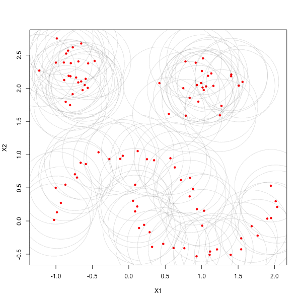

The dbscan package includes an implementation of Hierarchical DBSCAN (HDBSCAN). To illustrate how it works, consider the following:
```{r}
library("dbscan")
data("moons")
plot(moons, pch=20)
```

By default, HDBSCAN returns a flat clustering of the most salient or 'stable' clusters

```{r}
  cl <- hdbscan(moons, minPts = 5)
  cl
```

The 'flat' results are stored in the 'cluster' member. Noise points are given a value of 0. 
```{r}
 plot(moons, col=cl$cluster+1, pch=20)
```

## Robust Single Linkage 
The resulting HDBSCAN object contains a hierarchical representation of every possible DBSCAN* clusterings. This hierarchical 
representation is compactly stored in the familiar 'hc' member of the resulting HDBSCAN object, in the same format of 
traditional hierarchical clustering objects formed using the 'hclust' method from the stats package. 
```{r}
cl$hc
```

Note that although this object is available for use with any of the methods that work with 'hclust' objects, the distance method HDBSCAN uses (mutual reachability distance, see [2]) is not an available method of the hclust function. This hierarchy, denoted the "HDBSCAN* hierarchy" in [2], could also be considered to be an approximation of the empirical _cluster tree_, a more theoretical concept for the field of nonparametric statistics with a long history behind it. Considering the similarities between this hierarchy and single linkage clustering, the hierarchy could also be called the Robust Single Linkage cluster tree (see [4]). To visualize the hierarchy, simply use the built-in plotting method from the stats package 
```{r}
plot(cl$hc, main="Robust Single Linkage Dendrogram")
```

The Robust Single Linkage (RSL) tree does not need to be explicitly computed to compute HDBSCAN, but if the dendrogram representation is useful it can be computed ahead of time by specifying the 'gen\_rsl\_tree' parameter to equal TRUE when calling the HDBSCAN function.

## Validation: DBSCAN\* vs cutting the HDBSCAN\* tree 
As mentioned above, any cut in the HDBSCAN\* hierarchy is equivalent to running DBSCAN\* with the same $minPts$ parameter setting and height threshold ($eps$). But can this actually be tested as a means of validation? Using a modified function to distinguish noise using core distance as 0 (since the stats cutree method _does not_ assign singletons with 0), the results can be shown to be identical. 
```{r}
cl <- hdbscan(moons, minPts = 5)
check <- rep(F, nrow(moons)-1)
core_dist <- kNNdist(moons, k=5-1)[,5-1]

## cutree doesn't distinguish noise as 0, so we make a new method to do it manually 
cut_tree <- function(hcl, eps, core_dist){
  cuts <- unname(cutree(hcl, h=eps))
  cuts[which(core_dist > eps)] <- 0 # Use core distance to distinguish noise
  cuts
}

eps_values <- sort(cl$hc$height, decreasing = T)+.Machine$double.eps ## Machine eps for consistency between cuts 
for (i in 1:length(eps_values)) { 
  cut_cl <- cut_tree(cl$hc, eps_values[i], core_dist)
  dbscan_cl <- dbscan(moons, eps = eps_values[i], minPts = 5, borderPoints = F) # DBSCAN* doesn't include border points
  
  ## Use run length encoding as an ID-independent way to check ordering
  check[i] <- (all.equal(rle(cut_cl)$lengths, rle(dbscan_cl$cluster)$lengths) == "TRUE")
}
print(all(check == T))
```

## Simplified Tree
The HDBSCAN\* hierarchy is useful, but for larger data sets it can become overly cumbersome. The hdbscan object comes with a powerful visualization tool that plots the 'simplified' hierarchy, which shows __cluster wide__ changes over an infinite number of $eps$ thresholds. It is the default visualization dispatched by the 'plot' method
```{r}
 plot(cl)
```

You can change up colors
```{r}
 plot(cl, gradient = c("yellow", "orange", "red", "blue"))
```

... and scale the widths for individual devices appropriately 
```{r}
plot(cl, gradient = c("purple", "blue", "green", "yellow"), scale=1.5)
```

... even outline the most 'stable' clusters reported in the flat solution 
```{r}
plot(cl, gradient = c("purple", "blue", "green", "yellow"), show_flat = T)
```

## Cluster Stability Scores
Note the stability scores correspond to the labels on the condensed tree, but the cluster assignments in the cluster member element does not correspond to the labels in the condensed tree. Also note that these scores represent the stability scores _before_ the traversal up the tree that updates the scores based on the children. 
```{r}
print(cl$cluster_scores)
```

The individual point membership 'probabilities' are in the probabilities member element
```{r}
  head(cl$membership_prob)
```

These can be used to show the 'degree of cluster membership' by, for example, plotting points with transparencies that correspond to their membership degrees.   
```{r}
  plot(moons, col=cl$cluster+1, pch=21)
  colors <- sapply(1:length(cl$cluster), function(i) adjustcolor(palette()[(cl$cluster+1)[i]], alpha.f = cl$membership_prob[i]))
  points(moons, col=colors, pch=20)
```

## Global-Local Outlier Score from Hierarchies
HDBSCAN (2015) comes with a new outlier measure that measures the global-local outlier score of each point in the data set as well. An example of this is shown below, where unlike the membership probabilities, the opacity of point represents the amount of "outlierness" the point represents. Traditionally, outliers are generally considered to be observations that deviate from the expected value of their presumed underlying distribution, where the measure of deviation that is considered significant is determined by some statistical threshold value. In HDBSCAN, however, there exists points marked as 'noise' that aren't considered to be a part of any cluster. HDSBCAN used the well-cited definition from Hawkins et. all (1980) in to define an outlier "an observation that deviates so much from other observations as to arouse suspicions that it was generated by a different mechanism." 

__Note:__ Because of the distinction made that noise points, points that _are not_ assigned to any clusters, should be considered in the definition of an outlier, the outlier scores computed are not just the inversely-proportional scores to the membership probabilities. 
```{r}
  top_outliers <- order(cl$outlier_scores, decreasing = T)[1:10]
  colors <- sapply(1:length(cl$cluster), function(i) adjustcolor(palette()[(cl$cluster+1)[i]], alpha.f = cl$outlier_scores[i]))
  plot(moons, col=colors, pch=20)
  text(moons[top_outliers, ], labels = top_outliers, pos=3)
```

## How HDBSCAN Works 
Per the name, HDBSCAN is an algorithm that computes a hierarchy of (DBSCAN) clusters. (more explanation coming soon)

```{r, fig.show='animate', echo=FALSE, out.width = '6in'}
## Produced by the following with the saveGIF function
# library("animation")
# ani.options(interval = 0.35, nmax = length(cl$hc$height)) 
# last_eps_values <- rep(max(cl$hc$height), length(cl$hc$height)+1)+.Machine$double.eps
# for (eps in sort(cl$hc$height, decreasing = T)){
#     model <- dbscan::dbscan(moons, eps=eps, minPts = 5, borderPoints = F)
#     which_to_not_update <- which(model$cluster == 0) 
#     pt_type <- rep(20, length(model$cluster))
#     pt_type[which_to_not_update] <- 8
#     plot(moons, col=model$cluster+1, pch=pt_type)
#     last_eps_values[-which_to_not_update] <- eps
#     symbols(moons[, 1], moons[, 2], 
#             circles = last_eps_values, 
#             fg="black", add=T, lwd=0.15)#, lty=3)
#   }
library(animation)

saveGIF({
  for(i in 1:100){
    curve(sin(x), from = -5 + (i * 0.05), to = 5 + (i * 0.05), col = "red", ylab = "")
    curve(cos(x), from = -5 + (i * 0.05), to = 5 + (i * 0.05), add = TRUE, col = "blue", ylab = "")
    legend("topright", legend = c("sin(x)", "cos(x)"), fill = c("red", "blue"), bty = "n")
  }
}, interval = 0.1, ani.width = 550, ani.height = 350)
```


## A Larger Clustering Example 
A larger example data set generated from the SciKit-learn library (see [the SciKit-learn docs](http://hdbscan.readthedocs.io/en/latest/comparing\_clustering\_algorithms.html) for more details) very well shows off the usefulness of HDSBCAN, and is used here to illustrate the capabilities of the R implementation. Consider a much larger data set of 'blobs' consisting of multiple denser areas (that vary in density) that can be distinguished sufficiently well by a human, but fail to be caught by many clustering algorithms 
```{r}
data("blobs")
plot(blobs, pch=20, cex=0.25)
```

Using the single parameter setting of, say, 15, HDBSCAN finds 6 clusters
```{r}
cl2 <- hdbscan(blobs, minPts = 15)
cl2
```

Marking the noise appropriately and highlighting points based on their 'membership probabilities' as before, a nice visualization of the cluster structure can be easily crafted   
```{r}
  plot(blobs, col=cl2$cluster+1, 
       pch=ifelse(cl2$cluster == 0, 8, 1), # Mark noise as star
       cex=ifelse(cl2$cluster == 0, 0.5, 0.75), # Decrease size of noise
       xlab=NA, ylab=NA)
  colors <- sapply(1:length(cl2$cluster), 
                   function(i) adjustcolor(palette()[(cl2$cluster+1)[i]], alpha.f = cl2$membership_prob[i]))
  points(blobs, col=colors, pch=20)
```

The simplified tree can be very useful for larger data sets  
```{r}
  plot(cl2, scale = 3, gradient = c("purple", "orange", "red"), show_flat = T)
```

## Semi-supervised Clustering
Clustering is about learning structure from data, and is oft-quoted as a useful tool for exploratory analysis and visualization. 

```{r}
  data("iris")
  plot(iris[, 1:4], col=iris$Species)
```
```{r}
  iris_cl <- hdbscan(iris[, 1:4], minPts = 5, gen_hdbscan_tree = TRUE)
  plot(iris_cl)
```


```{r}

addE <- function(n) {
      if(is.leaf(n)) { attr(n, "edgePar") <- list(col = iris_cl$cluster[attr(n, "label")] + 1) }
      n
}
plot(dendrapply(iris_cl$hdbscan_tree, addE))

## Truth 
label_color <- structure(1:3, names=levels(iris$Species))
truthLabel <- function(n) {
      if(is.leaf(n)) { attr(n, "edgePar") <- list(col = label_color[[iris$Species[attr(n, "label")]]]) }
      n
}
plot(dendrapply(iris_cl$hdbscan_tree, truthLabel))
```

## Performance 
All of the computational and memory intensive tasks required by HDSBCAN were written in C++ using the Rcpp package. With DBSCAN, the performance depends on the parameter settings, primarily on the radius at which points are considered as candidates for clustering ('eps'), and generally less so on minPts. Larger values of eps increase the computation time. 
```{r}
  ## eps_vals == 4 increasing percentiles of neighbor sizes
  eps_vals <- quantile(as.vector(dist(blobs)))[2:5]
  microbenchmark::microbenchmark(dbscan::dbscan(blobs, eps = eps_vals[1], minPts = 15), times=15)
  microbenchmark::microbenchmark(dbscan::dbscan(blobs, eps = eps_vals[2], minPts = 15), times=15)
  microbenchmark::microbenchmark(dbscan::dbscan(blobs, eps = eps_vals[3], minPts = 15), times=15)
  microbenchmark::microbenchmark(dbscan::dbscan(blobs, eps = eps_vals[4], minPts = 15), times=15)
```

HDBSCAN requires information that would normally be accessible by running DBSCAN at every 'eps' value that creates a unique clustering by DBSCAN. Since there are $n$ - 1 of these clusterings, where $n$ is the length of the data set, a naïve approach might therefore be to run DBSCAN at each of these eps values, recording the information at each value. As one might expect, this would lead to extremely inefficient performance for large data sets! Even though all of this information is necessary for HDBSCAN to run, there are clever tricks used to improve the efficiency of HDBSCAN to a 'reasonable' level
```{r}
  microbenchmark::microbenchmark(dbscan::hdbscan(blobs, minPts = 15), times = 15)
  microbenchmark::microbenchmark(dbscan::dbscan(blobs, eps = eps_vals[4], minPts = 15), times = 15)
```

One of the primary computational bottleneck with using HDBSCAN is the computation of the full (euclidean) pairwise distance between all points, for which HDBSCAN currently relies on base R 'dist' method for. If a precomputed one is available, the running time of HDBSCAN can be moderately reduced. 
```{r}
  microbenchmark::microbenchmark(dbscan::hdbscan(blobs, minPts = 15), times = 15)
  dblobs <- dist(blobs)
  microbenchmark::microbenchmark(dbscan::hdbscan(blobs, xdist = dblobs, minPts = 15), times = 15)
```

Generally speaking, the larger the data set, the more likely the 'dist' method will dominate the calculation. 

## HDBSCAN Internals 
There are several minor computational tasks that take up a significant enough part of the computation to have been considered for optimization. Below are several benchmarks for what has recently been improved. 

The MST computation
```{r}
  microbenchmark::microbenchmark(vegan::spantree(dblobs), times = 500)
  microbenchmark::microbenchmark(dbscan:::prims(dblobs, attr(dblobs, "Size")), times = 500)
```

Naturally, the results are the same:
```{r}
  mst_vegan <- vegan::spantree(dblobs)
  mst_dbscan <- dbscan:::prims(dblobs, attr(dblobs, "Size"))
  sum(mst_vegan$dist) == sum(mst_dbscan[, 3])
```

The conversion from the MST to the information provided by 'hclust' objects 
```{r}
  microbenchmark::microbenchmark(as.hclust(mst_vegan))
  microbenchmark::microbenchmark(dbscan:::hclustMergeOrder(mst_dbscan, o = order(mst_dbscan[, 3])))
```

There are optional computations that, by default, are not computed by HDSBCAN. This includes the explicit computation of the RSL dendrogram and simplified hierarchies. Nonetheless, optimized code for this is available as well. 
```{r}
  hcl_vegan <- vegan:::as.hclust.spantree(mst_vegan)
  hcl_dbscan <- dbscan:::hclustMergeOrder(mst_dbscan, o = order(mst_dbscan[, 3]))
  microbenchmark::microbenchmark(as.dendrogram(hcl_vegan)) # stats S3 method 
  microbenchmark::microbenchmark(dbscan:::buildDendrogram(hcl_dbscan))
```

Of course, the two produce the same dendrogram.
```{r}
  all.equal(stats:::as.dendrogram.hclust(cl$hc), dbscan:::buildDendrogram(cl$hc)) 
```

Finally, the primary method at which all the information needed by HDBSCAN is the "hdbscan_fast" method. It's been greatly improved with each passing version in both memory and computational efficiency. The primary workhorse that does all of the primary calculations for HDBSCAN including the the recording of all of the eps distance changes for all of the points at every $n-1$ hierarchical level, the GLOSH outlier scoring, the membership probabilities, the stability traversal and resulting salient cluster extraction--all of it runs in just a few millseconds for 2000+ point data set, making HDBSCAN suitable for larger data sets.
```{r}
  microbenchmark::microbenchmark(dbscan:::hdbscan_fast(cl2$hc, minPts = 15))
```
## References 
1. Martin Ester, Hans-Peter Kriegel, Joerg Sander, Xiaowei Xu (1996). A Density-Based Algorithm for Discovering Clusters in Large Spatial Databases with Noise. Institute for Computer Science, University of Munich. Proceedings of 2nd International Conference on Knowledge Discovery and Data Mining (KDD-96).

2. Campello, R. J. G. B.; Moulavi, D.; Sander, J. (2013). Density-Based Clustering Based on Hierarchical Density Estimates. Proceedings of the 17th Pacific-Asia Conference on Knowledge Discovery in Databases, PAKDD 2013, Lecture Notes in Computer Science 7819, p. 160.

3. Campello, Ricardo JGB, et al. "Hierarchical density estimates for data clustering, visualization, and outlier detection." ACM Transactions on Knowledge Discovery from Data (TKDD) 10.1 (2015): 5.

4. Chaudhuri, Kamalika, and Sanjoy Dasgupta. "Rates of convergence for the cluster tree." Advances in Neural Information Processing Systems. 2010.

